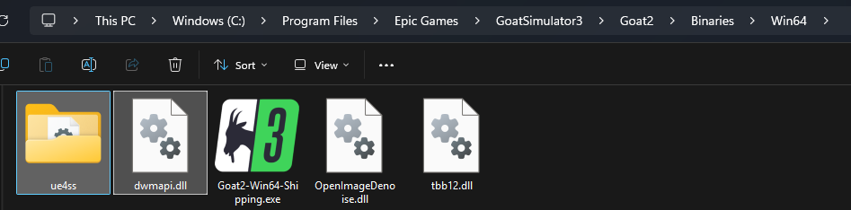
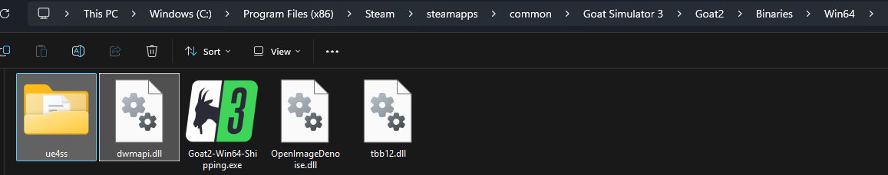
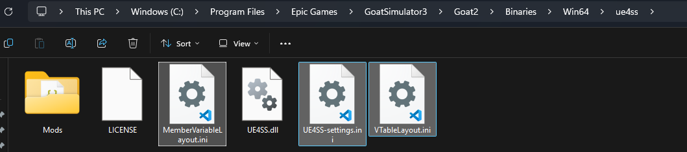
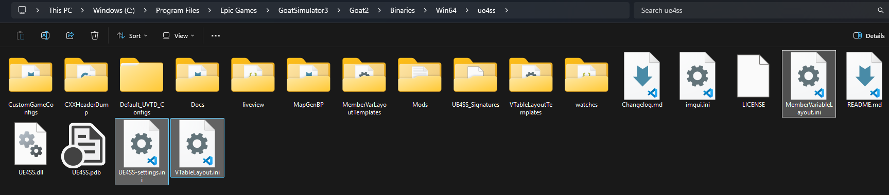
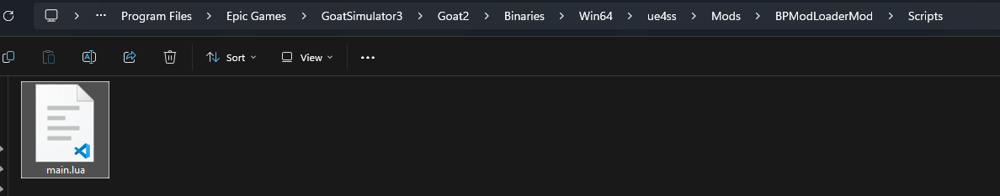
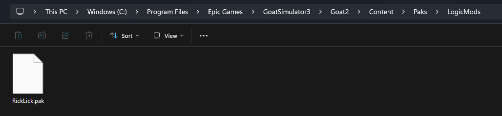

# How to install Blueprint mod for Goat Simulator 3

This is a guide on how to install Blueprint mods for Goat Simulator 3 using UE4SS.

I got tired of writing installation instructions for every mod I make, so I decided to compile them all here.  
If someone else has created a Blueprint mod and finds it tedious to write their own instructions, they can simply link to this guide.

## Install UE4SS

1. Download the experimental version of [UE4SS](https://github.com/UE4SS-RE/RE-UE4SS/releases/tag/experimental)  
    - Since the experimental-latest build may be unstable, it might be preferable to download [UE4SS_v3.0.1-942-gc0335505.zip](https://github.com/UE4SS-RE/RE-UE4SS/releases/download/experimental/UE4SS_v3.0.1-942-gc0335505.zip) or [zDEV-UE4SS_v3.0.1-942-gc0335505](https://github.com/UE4SS-RE/RE-UE4SS/releases/download/experimental/zDEV-UE4SS_v3.0.1-942-gc0335505.zip), which have been confirmed to work properly.  
    The zDev version is intended for mod developers, so if you only want to install mods, the standard UE4SS version is sufficient.  
    - The release version v3.0.1 does not work properly—when installing a C++ Mod, it throws a 0x7f error and fails to run.  

2. Extract UE4SS and place it in GoatSimulator3/Goat2/Binaries/Win64.  
    - Epic Games:  
      
    - Steam:  
      

## Install UE4SS GOAT Patch

1. Download [UE4SS GOAT Patch](https://www.nexusmods.com/goatsimulator3/mods/42?tab=files) and extract it.

2. Move all extracted contents into the ue4ss folder. Overwrite UE4SS-settings.ini when prompted.  
    - Standard:  
      
    - zDev:  
    

## Install BPModloader GOAT Patch

1. Download [BPModLoader GOAT Patch](https://www.nexusmods.com/goatsimulator3/mods/43?tab=files) and extract it.

2. Replace main.lua in ue4ss/Mods/BPModLoaderMod/Scripts with the main.lua included in BPModLoader GOAT Patch.  
    

## Install Blueprint Mod

1. Launch the game once.  
    - This is to generate the LogicMods folder and to make sure the game runs properly at this point.

2. Download and extract any Blueprint Mod of your choice.  
    - As an example, we will use the [RickLick](https://www.nexusmods.com/goatsimulator3/mods/44?tab=files)

3. Place it in GoatSimulator3/Goat2/Content/Paks/LogicMods.  
      
    - Do not rename the .pak file, as it may no longer be recognized correctly.

4. Enjoy the game with the mod.