# How to use UE4GameProjectGenerator (not sure if it’s correct)

This is a guide for people who are overwhelmed by the overly detailed explanations of [UE4GameProjectGenerator](https://github.com/Buckminsterfullerene02/UE4GameProjectGenerator), using the Epic Games version of Goat Simulator 3 as an example.

## Please Note

I mostly made fixes that just masked the problems, and since the errors probably differ for each game, I’m not sure how helpful this will be.

I wrote this while redoing every step myself, so the order is a bit inconvenient in places.  
As a document, it would probably make more sense to follow the sequence: "Since this XXX error will occur later, we fix it in advance" → "Build."  
However, the actual flow here is: "Build" → "This XXX error occurs, so we fix it" → "Build again while praying to God."  
Well, it’s perfect if you want to experience my struggles firsthand.

This guide has been translated using ChatGPT.  
There may be slight differences in nuance or the text might feel somewhat AI-generated, but rest assured, there are no hallucinations.

## Why Use UE4GameProjectGenerator?

UE4GameProjectGenerator is used to set up an environment for creating Blueprint Mods in games made with Unreal Engine.

If you try to create a Blueprint Mod in Unreal Engine without any configuration, you won’t be able to call game-specific functions or access elements of game-specific classes.

## Requirement

- UnrealEngine
- [Visual Studio](https://visualstudio.microsoft.com/downloads/)
    - You can install Visual Studio 2022 by downloading the installer and running the command  
    "visualstudiosetup.exe --channelUri https://aka.ms/vs/17/release/channel"  
    Also, at that time, please add the Workloads and Components according to [Epic Games instructions](https://dev.epicgames.com/documentation/en-us/unreal-engine/setting-up-visual-studio-development-environment-for-cplusplus-projects-in-unreal-engine?application_version=5.6)
- [UE4SS](https://github.com/UE4SS-RE/RE-UE4SS/)
- [UE4GameProjectGenerator](https://github.com/Buckminsterfullerene02/UE4GameProjectGenerator)
- [repak](https://github.com/trumank/repak/releases)

## Preparing the Required Items

1. Install zDev-UE4SS into the game
    - [How to install Blueprint mod for Goat Simulator 3](./How-to-install-Blueprint-mod.md)  
    This is aimed at Goat Simulator 3, but this resource may be helpful.

2. Generate UHT Compatible Headers
    - Launch the game.  
    From UE4SS’s Debug Tools, select Dumpers → Generate UHT Compatible Headers.

    - A UHTHeaderDump folder will be created in the ue4ss directory.  
    For the Epic Games version of Goat Simulator 3, it is located at:  
    C:\Program Files\Epic Games\GoatSimulator3\Goat2\Binaries\Win64\ue4ss\UHTHeaderDump

3. Unpack the game’s pak file
    - Install [repak](https://github.com/trumank/repak/releases) using the msi, and restart your computer once to allow the system to recognize the repak path.

    - From the Command Prompt, run repak unpack "path to the game's .pak file"  
    For Goat Simulator 3:
    ```
    repak unpack "C:\Program Files\Epic Games\GoatSimulator3\Goat2\Content\Paks\Goat2-WindowsNoEditor.pak"
    ```

    - The output will be generated in the same directory as the .pak file

## Build UE4GameProjectGenerator

1. Download and extract [UE4GameProjectGenerator](https://github.com/Buckminsterfullerene02/UE4GameProjectGenerator), then place it in an easy-to-find location.

2. Switch Unreal Engine version
    - Right-click on GameProjectGenerator.uproject and select 'Switch Unreal Engine Version...'.
        - If the .uproject file is not associated with Unreal Engine and the right-click menu option does not appear, [this site](https://colory-games.net/site/en/uproject_right_click_missing-en/) may be helpful.

    - Change to the version of Unreal Engine that matches the game.
        - You can check the game's Unreal Engine version by right-clicking the game's .exe file and going to Properties → Details → File Version. For Goat Simulator 3, it is 4.27.2.
        - For this step, you need to have Unreal Engine installed with the same version as the game.

    - You may encounter an error saying that UnrealBuildTool.exe cannot be found.
        - In that case, [this post](https://forums.unrealengine.com/t/missing-unrealbuildtool-exe-after-build/2674046/12) may be helpful.
        - In short, go to C:\Program Files\Epic Games\UE_4.27\Engine\Config and simply add the following at the very end of BaseEngine.ini:
        ```
        [PlatformPaths]
        UnrealBuildTool=Engine/Binaries/DotNET/UnrealBuildTool.exe
        ```

3. Try installing the plugins used by the game into Unreal Engine.
    - I couldn’t understand step 2 of UE4GameProjectGenerator, so I’m not sure if it’s necessary.

    - Open Unreal Engine, create a new project, and once it’s open, you can add plugins from Edit → Plugins

    - You can check the plugins used by the game from the files unpacked with Repak.  
    For Goat Simulator 3, open Goat2.uproject located in \Goat2-WindowsNoEditor\Goat2 (generated by unpacking) with a text editor like Notepad to see them

    - Search for each Name listed under Plugins in the Unreal Engine Plugins window, and enable them if found.  
        - Q: What if it’s a game-specific plugin or I can’t find it?  
        A: IDK. Just ignore that plugin.

4. Build UE4GameProjectGenerator
    - Open the GameProjectGenerator.sln generated in Step 2 using Visual Studio

    - Make sure DevelopmentEditor is chosen, and then build the solution.

## Use UE4GameProjectGenerator

1. Prepare the command
    - The [README of UE4GameProjectGenerator](https://github.com/Buckminsterfullerene02/UE4GameProjectGenerator/blob/master/README.md) finally comes in handy

    - I will show an example from my environment. Some parts won’t work if you just copy and paste, so please modify them as needed    
    ```
    "C:\Program Files\Epic Games\UE_4.27\Engine\Binaries\Win64\UE4Editor-Cmd.exe" "C:\Users\User\Documents\Unreal Projects\UE4GameProjectGenerator\GameProjectGenerator.uproject" -run=ProjectGenerator -HeaderRoot="C:\Program Files\Epic Games\GoatSimulator3\Goat2\Binaries\Win64\ue4ss\UHTHeaderDump" -ProjectFile="C:\Program Files\Epic Games\GoatSimulator3\Goat2\Content\Paks\Goat2-WindowsNoEditor\Goat2\Goat2.uproject" -PluginManifest="C:\Program Files\Epic Games\GoatSimulator3\Goat2\Content\Paks\Goat2-WindowsNoEditor\Goat2\Plugins\Goat2.upluginmanifest" -OutputDir="C:\Users\User\Documents\Unreal Projects\Goat2_mod_env" -stdout -unattended -NoLogTimes
    ```

    - You must create the OUTPUT_DIR in advance. In my case, I manually created C:\Users\User\Documents\Unreal Projects\Goat2_mod_env

    - It's a good idea to write down the commands you created somewhere.  
    If an error occurs or you need to redo a step later, retyping them would be a hassle.

2. Run the command while praying to your god.

## Battling the generated .uproject
I'm not sure if I used UE4GameProjectGenerator correctly, but fortunately, Goat2.uproject was generated in Goat2_mod_env folder.

1. Right-click the generated .uproject file and select 'Generate Visual Studio project files'

2. Failed to generate Visual Studio project files.
    - According to the error message, it seems that having an unknown platform is causing the problem.

3. Remove the unknown platform from the .uproject file
    - Open the .uproject file with a text editor like Notepad or VS Code.

    - In every Plugin section that has a 'Platforms' field, remove "XSX", "PS5", "WinGDK", "Switch", and "XboxOneGDK".

4. Right-click the generated .uproject file and select 'Generate Visual Studio project files'

5. Open the generated .sln file from Visual Studio

6. Hoping that the build might succeed by some chance, select game solution, make sure 'Development Editor' is selected, and then build.

## Battling numerous errors
Well, there was no way the build would pass.
Below, I’ll share the errors I encountered and a way to get the build to go through (though I wouldn’t exactly call it a fix), so you can take it or leave it as reference.

- Couldn't find parent type for 'GGGoatAssetManager' named 'UGGGameAssetManager' in current module (Package: /Script/Goat2) or any other module parsed so far.
    - Looking at the SDK generated by Dumper-7, UGGGameAssetManager is a class that inherits from UAssetManager.
    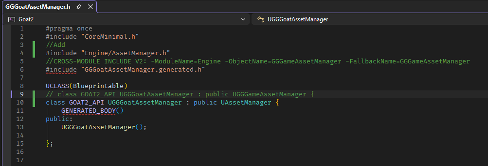

- Unrecognized type 'FOnGainedSignificance' - type must be a UCLASS, USTRUCT or UENUM
    - After searching for 'OnGainedSignificance' in the code, I found that it is defined in OnGainedSignificanceDelegate.h.  
    The same applies to FOnLostSignificance.
    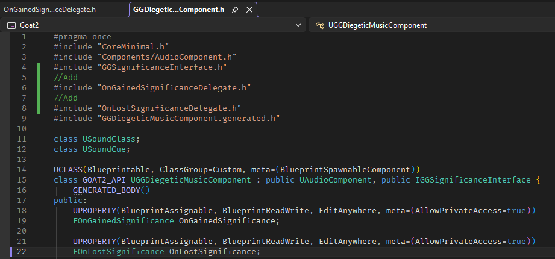

- Type XXX is not supported by blueprint.
    - It’s the same as Game 3 Error 3 in the [UE4SS Documentation](https://docs.ue4ss.com/guides/generating-uht-compatible-headers.html).
    You can fix it simply by removing either BlueprintReadWrite or BlueprintCallable

At this point, the errors stopped appearing. That was easier than expected. Let’s build.
...and then 139 errors appeared. Alright, let’s get to work.

- function XXX already has a body File:LSReplicatedMeshRPCs.gen.cpp
    - Since gen.cpp is automatically generated and can't be modified, I went to LSReplicatedMeshRPCs.h and commented out all the PURE_VIRTUAL sections
    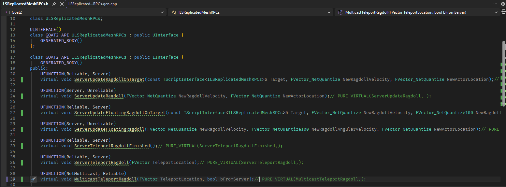

- function XXX already has a body File:GGCompanion_Owl.gen.cpp
    - It's basically the same as LSReplicatedMeshRPCs. Go to GGCompanion_Owl.h and comment out the PURE_VIRTUAL parts after the 'override'.
    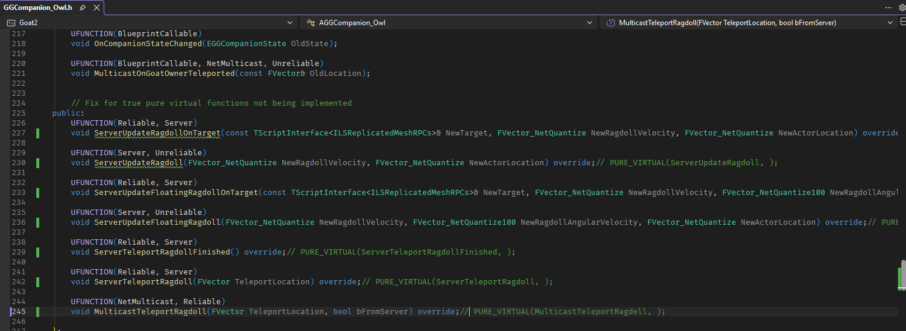

- CLASS::FUNCTION(): overloaded member function not found in CLASS File:XXX.gen.cpp
    - It’s the same as the cyubeVR error in the [UE4SS Documentation](https://docs.ue4ss.com/guides/generating-uht-compatible-headers.html)
    - Remove TEnumAsByte from the function parameters in both the header declaration and the _Implementation function in the cpp file.
    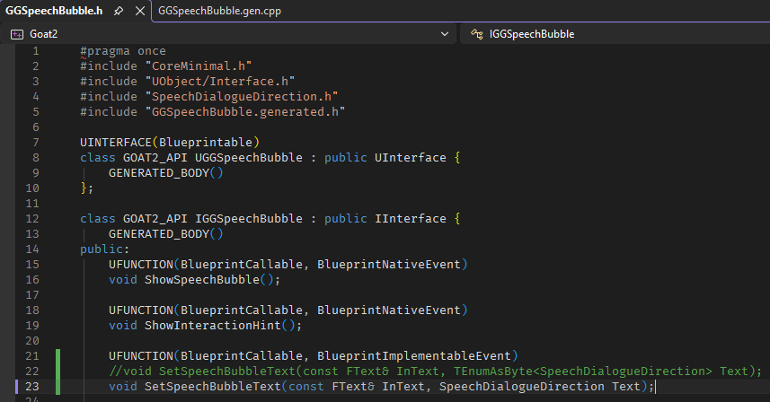
    - Be careful not to remove TEnumAsByte from functions that aren’t causing errors.

- 'UTileView': no appropriate default constructor available  
    'UDemoNetDriver': no appropriate default constructor available
    - It’s the same as Game 3 Error 6 in the [UE4SS Documentation](https://docs.ue4ss.com/guides/generating-uht-compatible-headers.html)

    - Modify the constructor as shown in the example.
    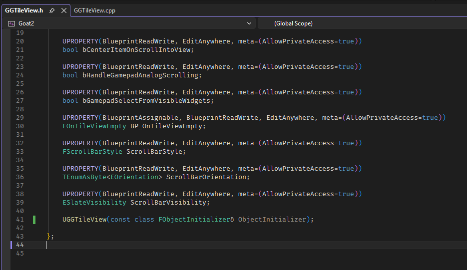
    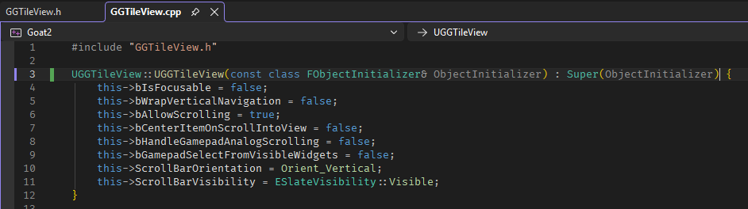

- A large number of errors occurring around AGGVehicle_Car and AGGGoat
    - It’s the same as Game 3 Error 4 in the [UE4SS Documentation](https://docs.ue4ss.com/guides/generating-uht-compatible-headers.html).
    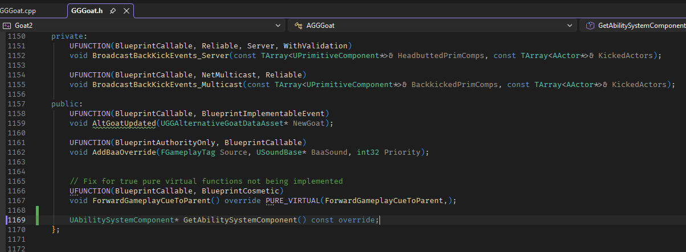
    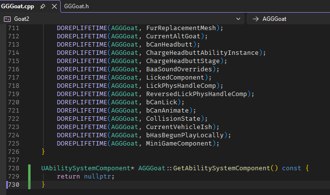
    - Make the same fix for AGGVehicle as well

- 'UObject::CreateDefaultSubobject': no matching overloaded function found  
    'UBP_VehicleEngineSoundController_C': undeclared identifier
    - If it doesn’t exist, there’s nothing we can do.  
    Since the type of EngineSoundController is UGGVehicleEngineSoundController, I’ll change UBP_VehicleEngineSoundController_C to UGGVehicleEngineSoundController."
    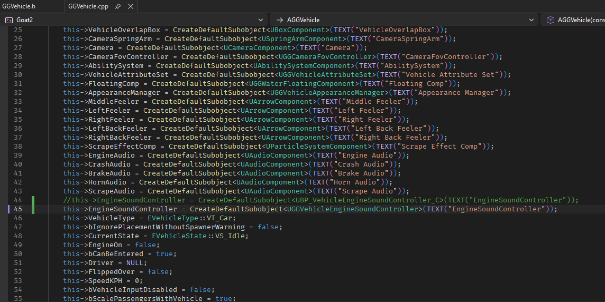

- 'bXXX': is not a member of 'XXX'
    - If it doesn’t exist, there’s nothing we can do (second time). Let’s comment it out.
    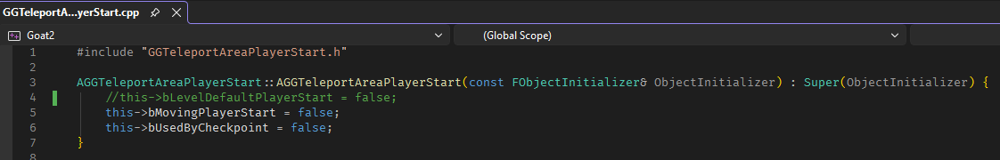

Alright, that should have cleared the errors. Let’s build.
...and then 665 'unresolved external symbol' errors appear.
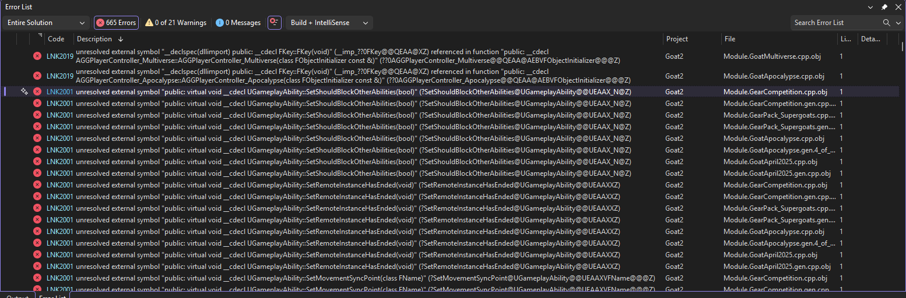  

This indicates that the plugin dependencies are not set up correctly.

For example, in Module.GoatMultiverse, there are errors related to FKey.  
Since [FKey is part of InputCore](https://dev.epicgames.com/documentation/en-us/unreal-engine/API/Runtime/InputCore), adding InputCore to PublicDependencyModuleNames.AddRange in GoatMultiverse.Build.cs will eliminate this error.  
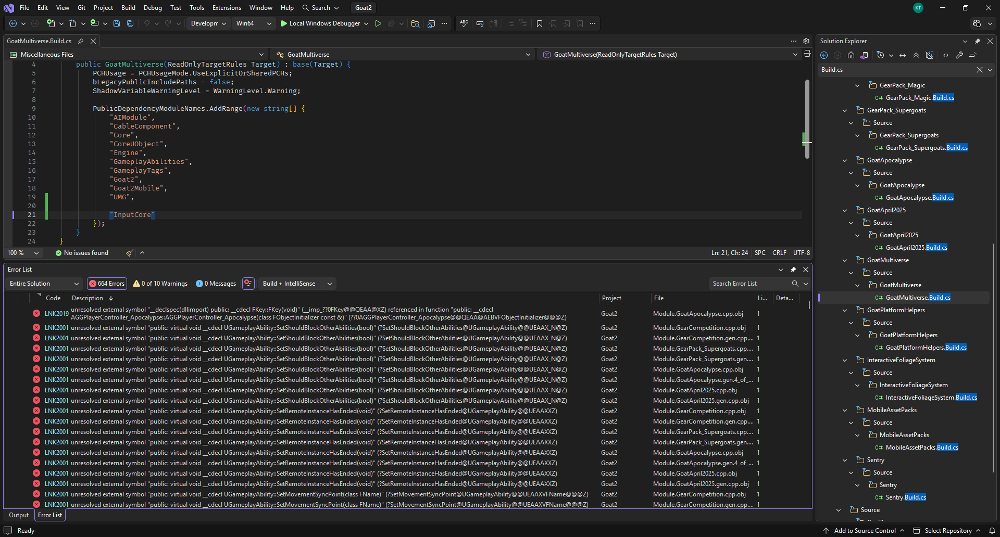  
You did it! Now there are only 664 errors left.

I used ChatGPT to check which module each thing belongs to.  
If you ask something like, 'In Unreal Engine, which module contains UGamePlayAbility?', it will give you the answer.  
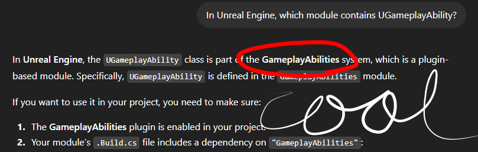  
There is also the official documentation, but it was kind of hard to read.

In Goat Simulator 3, for now, adding 'GameplayAbilities' and 'GameplayTasks' to specific plugins like GearPack or Multiverse will fix most of the errors.  
And even now, there are still errors.

- unresolved external symbol "public: virtual void __cdecl AGGCompanion_Owl::ServerUpdateRagdoll_Implementation(struct FVector_NetQuantize,struct FVector_NetQuantize)" (?ServerUpdateRagdoll_Implementation@AGGCompanion_Owl@@UEAAXUFVector_NetQuantize@@0@Z)
    - You need to do the opposite of the error you fixed a little while ago.

    - Open the header and cpp files of GGCompanion_Owl, copy all the functions that are causing errors from the header, and then write empty function_Implementation as shown in the image to fix it.
    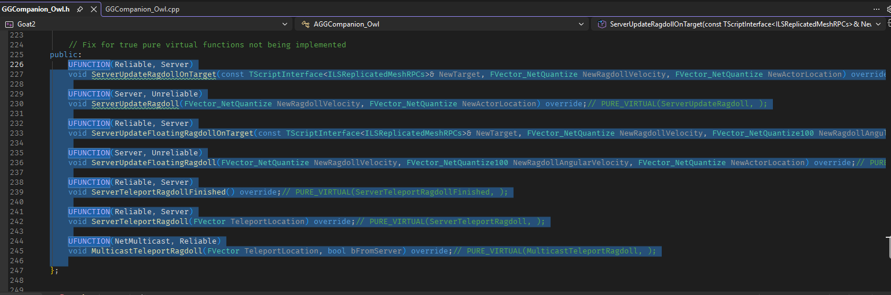
    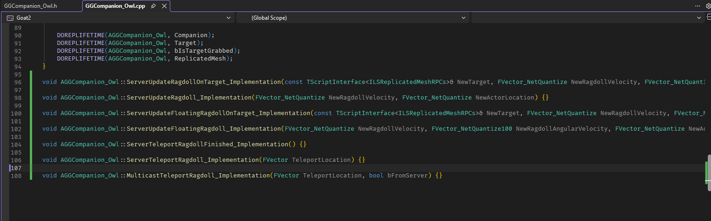

- unresolved external symbol "public: virtual void __cdecl ACullDistanceVolume::PostEditMove(bool)" (?PostEditMove@ACullDistanceVolume@@UEAAX_N@Z)
    - I wasn’t sure how to fix this, so let’s mask the problem.
    
    - Since ACullDistanceVolume is a class that inherits from AVolume, open GGPerPlatformCullDistanceVolume.h and replace it with that.

    - Because replacing it may cause side effects, open GGPerPlatformCullDistanceVolume.cpp and comment out the relevant parts.
    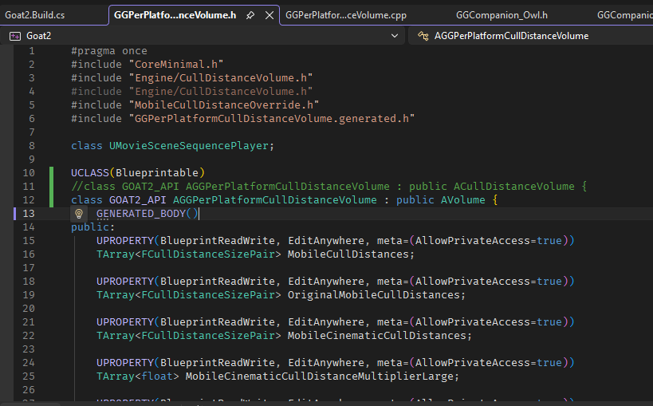
    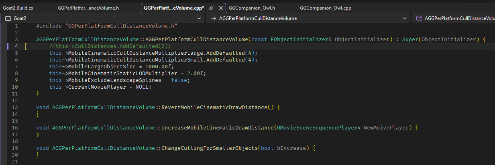

Finally, the build went through. We did it!

## After Build

Open the .uproject in Unreal Engine.  
Since the build is already complete, we'll start from the point where the Unreal Editor opens.

Hopefully, there won’t be any errors from here on in games other than Goat Simulator 3.  
Yes, there are still errors in Goat Simulator 3.

- Try to fix the Fracture Editor load failure.  
    - Let’s check the logs output in Saved/Logs to investigate the cause.  
    There were errors like:  
    ```
    Failed to load 'C:/Program Files/Epic Games/UE_4.27/Engine/Plugins/Experimental/ChaosEditor/Binaries/Win64/UE4Editor-FractureEditor.dll' (GetLastError=126)
    Missing import: UE4Editor-PlanarCut.dll
    ```
    - By default, UE4Editor-PlanarCut.dll can be found at:  
    C:\Program Files\Epic Games\UE_4.27\Engine\Plugins\Experimental\PlanarCutPlugin\Binaries\Win64  
    If you place it in the Binaries\Win64 folder that Unreal Engine recognizes, the Fracture Editor will load successfully.

Alright, now it shouldn’t stop loading at 75% anymore. Let’s open the .uproject!  
…Yep, it doesn’t stop at 75%. It crashes around 90% instead.

- Mask the issues related to the StaticMeshComponent and ParticleSystemComponent
    - Looking at the log again, there is the following error:
    ```
    StaticMeshComponent /Script/GoatApocalypse.Default__GGGoat_Apocalypse:Horn Component, ReferencingObjectClass: Class /Script/Engine.StaticMeshComponent, Property Name: AttachParent, Offset: 208, TokenIndex: 15
    StaticMeshComponent /Script/Goat2.Default__GGNPC_Humanoid:Hair, ReferencingObjectClass: Class /Script/Engine.StaticMeshComponent, Property Name: AttachParent, Offset: 208, TokenIndex: 15
    ParticleSystemComponent /Script/GoatApocalypse.Default__GGSandWorm:Ongoing Move Particles, ReferencingObjectClass: Class /Script/Engine.ParticleSystemComponent, Property Name: AttachParent, Offset: 208, TokenIndex: 15
    ```
    - Looking at each constructor, there was quite a bit of suspicious code.  
    And I simply commented it out and pretended it never existed. I couldn’t think of a way to fix it anyway.
    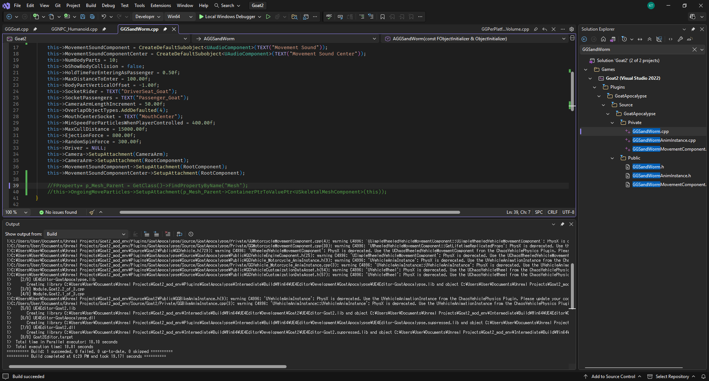
    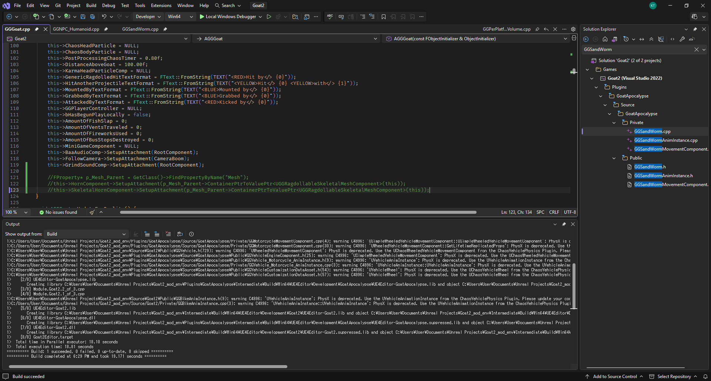
    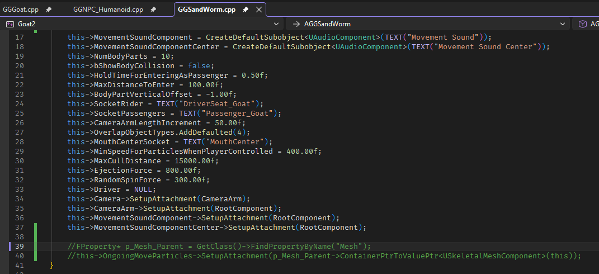

After rebuilding and opening it in Unreal Engine, you can finally start Blueprint modding...Well, for some reason, the UE4Editor-PlanarCut.dll keeps getting deleted every time we rebuild, so we have to put it back.